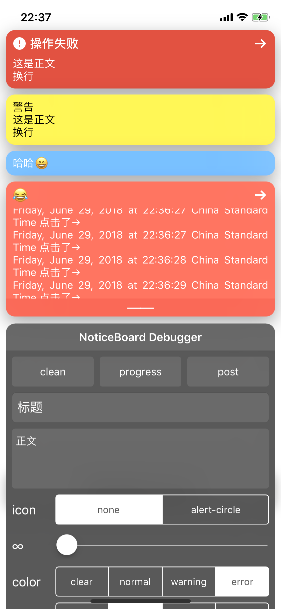

# NoticeBoard

[](https://raw.githubusercontent.com/xaoxuu/NotiveBoard/master/LICENSE)  [](https://www.apple.com/nl/ios/)  [](https://cocoapods.org/pods/NotiveBoard)  [](https://codeload.github.com/xaoxuu/NotiveBoard/zip/master)  [](https://cocoapods.org/pods/NotiveBoard) 


一个简单易用的应用内消息通知框架。




### 使用

```swift
// 创建notice
let notice = Notice.init(title: "标题", icon: UIImage.init(named: "alert-"), body: "正文")
// 发布notice       
NoticeBoard.shared.post(notice, duration: 2)
// 移除某个通知
NoticeBoard.shared.remove(notice)
// 清空
NoticeBoard.shared.clean()
```

> NoticeBoard中的func均提供了同名的class func，等同于NoticeBoard.shared。

个性化设置

```swift
// 按钮事件
notice.actionButtonDidTapped { (notice, btn) in
    print("点击了'→'按钮")
}

// 设置颜色主题
notice.setTheme(.light) // 模糊背景，和纯色背景可以同时使用
notice.setTheme(.error) // 枚举
notice.setTheme(.init(red: 0.2, green: 0.3, blue: 0.4, alpha: 1)) // 任意UIColor
notice.setTheme(backgroundColor: .red, textColor: .white) // 指定背景色和文字颜色
```


### 快速post

```swift
let notice = NoticeBoard.post(.warning, message: "消息正文", duration: 2)
```

> 第一个参数同setTheme()，可以传入枚举、模糊效果、任意UIColor。
>
> 返回值为notice实例，可以随时更改notice。


### post进度

设置 `notice` 实例的 `progress` 属性，即时生效。

```swift
// 进度为0
notice.progress = 0
// 进度为50%
notice.progress = 0.5
// 进度为100%
notice.progress = 1
```


### 多个通知的布局

如果同一时间需要存在多个通知，可以根据使用场景选择不同的布局方式：

```swift
// 平铺，默认（所有通知都可见，但是通知过多会超出屏幕）
NoticeBoard.post(notice, duration: 2, layout: .tile)

// 取代旧的通知（旧的采用fade动画淡出）
NoticeBoard.post(notice, duration: 2, layout: .replace)

// 移除旧的通知（旧的采用moveout动画移出屏幕）
NoticeBoard.post(notice, duration: 2, layout: .remove)

// 覆盖在旧的通知上层（切勿堆积过多）
NoticeBoard.post(notice, duration: 2, layout: .replace)

// 堆叠（最新的通知会遮挡旧的通知）
NoticeBoard.post(notice, duration: 2, layout: .replace)
```


### 设置Level

默认提供了四种level：

```swift
// case low = 4000
// case normal = 4100
// case high = 4200
// case veryHigh = 4300
notice.level = .normal
```

也可以直接设置任意数值：

```swift
notice.windowLevel = 1000
```


### 在Swift和Objective-C中使用

`NoticeBoard`使用`Swift4.1`语言编写，如需在`Objective-C`项目中使用，可以采用`Objective-C`和`Swift`混编的方式，详情请参照示例程序：`Example-OC`。